# MEImage2Latex

OCR Engine for mathematical expression to latex translation using CNN with AI approach

## Introduction

In this project, includes source code of a neural network for single character recognition and code for train network using keras api. For translation of image to latex form, few steps are required

1. Preprocess of whole image
2. Seperate single character using contour
3. Recognize characters using CNN model
4. Translate to Latex with information of their position

Additionally, for application using this engine, we made "Calcuator for Comfort". 

Here is demo link: https://www.youtube.com/watch?v=vi6pRBC3YW8

## Prerequisite

1. Python: 3.7.7
2. Keras: 2.3.1
3. Tensorflow: 2.1.0

## Model

CNN model for single character classification. Modified from vgg16.

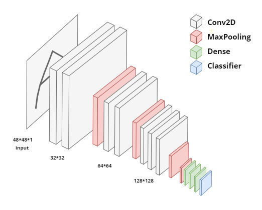

Used handwritting mathematic symbol data for train this model.

Data link: https://www.kaggle.com/xainano/handwrittenmathsymbols

## Examples

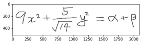  

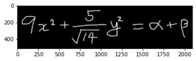  

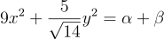

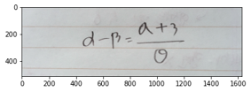  

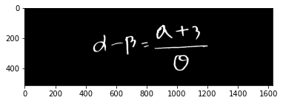  

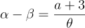

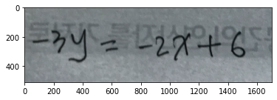  

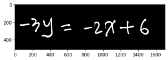  

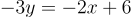

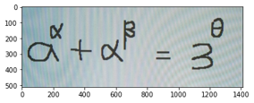  

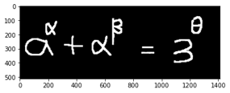  

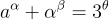

